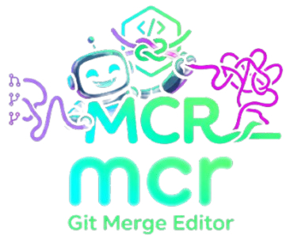

<p align="center">
  
</p>

# MCR

A **three-pane visual merge editor** — see the two diverging sides and the merged
result side by side, trace every change with line-locked highlights and connector
ribbons, and apply or revert each change individually. Built with a Rust core
(diff / alignment / reversible apply-revert) and a Tauri + CodeMirror UI.

- **Three panes**: local · editable result · incoming.
- **Trace changes**: line bands, word-level highlights, and curved connectors
  that bind each side change to its result region and follow the lines as you scroll.
- **Apply / revert**: per-change gizmos, bulk "apply all non-conflicting", and
  fully reversible undo/redo.
- **Configurable keyboard shortcuts** (Cmd+Z / Cmd+Shift+Z by default).
- **Tokyo Night** theme.

---

## Install

### macOS (Apple Silicon)

**Homebrew** (recommended):

```bash
brew install --cask mayckol/tap/mcr
```

**curl**:

```bash
curl -fsSL https://raw.githubusercontent.com/mayckol/mcr/main/scripts/install.sh | sh
```

Installs `MCR.app` to `/Applications`. The build is unsigned, so on the **first
launch** right-click the app → **Open** (Gatekeeper blocks a normal double-click
once). The installer strips the quarantine flag, so subsequent launches are normal.

### Linux (x86_64)

```bash
curl -fsSL https://raw.githubusercontent.com/mayckol/mcr/main/scripts/install.sh | sh
```

Installs the AppImage to `~/.local/bin/mcr.AppImage` with a `mcr` launcher and an
application-menu entry + icon. If `~/.local/bin` isn't on your `PATH`, the
installer tells you to add it.

Change the install prefix with `MCR_PREFIX`:

```bash
curl -fsSL .../install.sh | MCR_PREFIX=/usr/local sh
```

### Pin a specific version

```bash
curl -fsSL .../install.sh | MCR_VERSION=v0.1.0 sh
```

### Requirements

- **macOS**: 11 (Big Sur) or later, Apple Silicon.
- **Linux**: x86_64 with a WebKitGTK runtime (`libwebkit2gtk-4.1`), present on
  most modern desktops.

---

## Uninstall

**curl** (macOS and Linux):

```bash
curl -fsSL https://raw.githubusercontent.com/mayckol/mcr/main/scripts/install.sh | sh -s -- --uninstall
```

Removes `MCR.app` (macOS) or the AppImage + launcher + desktop entry (Linux).

**Homebrew** (macOS):

```bash
brew uninstall --cask mcr
```

---

## Usage

Launch **MCR** from the Applications menu / Launchpad, or from a terminal:

```bash
mcr              # Linux launcher
open -a MCR      # macOS
```

### The window

| Pane | Meaning |
|------|---------|
| **Local** (left) | Your side — read-only |
| **Result** (center) | The merged output — editable; this is what you keep |
| **Incoming** (right) | The other side — read-only |

Every changed region is highlighted and connected by a ribbon to its matching
lines in the result pane. Colors distinguish **added**, **removed**, **modified**,
and **conflicting** regions. The panes scroll together and the connectors stay
locked to their lines.

### Resolving changes

- **Apply a change** — click the `»` gizmo on the left to take the local version,
  or `«` on the right to take the incoming version. The result updates instantly.
- **Revert a change** — click the `×` gizmo on the applied region to undo it.
- **Bulk apply** — the toolbar `» Left` / `All` / `Right «` buttons apply every
  non-conflicting change from that side at once (conflicts are skipped).
- **Edit directly** — type in the center result pane; the region's state updates
  to "manually edited".
- **Navigate** — `↑` / `↓` jump to the previous / next change.
- **Undo / Redo** — every apply, revert, and bulk action is reversible.
- **Status** — the top-right shows how many conflicts remain (and "Resolved" when
  the file is fully merged).

### Whitespace

The **Whitespace** dropdown toggles how differences are detected: *Do not ignore*
(default), *Ignore trailing*, or *Ignore all*. Whitespace-only changes disappear
when ignored.

### Keyboard shortcuts

Defaults (⌘ = Cmd on macOS, Ctrl elsewhere):

| Action | Shortcut |
|--------|----------|
| Undo | `⌘Z` |
| Redo | `⌘⇧Z` |
| Apply all non-conflicting | `⌘⌥A` |
| Apply all from left / right | `⌘⌥←` / `⌘⌥→` |
| Next / previous change | `⌥↓` / `⌥↑` |

Click the **⌨** toolbar button to open the shortcuts panel: click any shortcut,
press the new keys to rebind it, `Esc` cancels, **Reset to defaults** restores
them. Bindings are saved and persist across restarts.

### Use as a `git mergetool`

MCR honors Git's mergetool contract: it reads `LOCAL` / `BASE` / `REMOTE`,
resolves into `MERGED`, and exits `0` on **Save & Exit** or non-zero on
**Abort**. When invoked with four file paths it opens those files instead of the
demo; otherwise it runs standalone.

Configure it once (the `.cmd` must point at the **blocking** binary — not the
detaching launcher — so Git waits for the result):

**macOS:**

```bash
git config --global merge.tool mcr
git config --global mergetool.mcr.cmd \
  '/Applications/MCR.app/Contents/MacOS/MCR "$LOCAL" "$BASE" "$REMOTE" "$MERGED"'
git config --global mergetool.mcr.trustExitCode true
```

**Linux:**

```bash
git config --global merge.tool mcr
git config --global mergetool.mcr.cmd \
  '"$HOME/.local/bin/mcr.AppImage" "$LOCAL" "$BASE" "$REMOTE" "$MERGED"'
git config --global mergetool.mcr.trustExitCode true
```

Then, on a conflicted repo:

```bash
git merge some-branch     # produces conflicts
git mergetool             # opens MCR for each conflicted file
```

Resolve with the apply/revert gizmos, click **Save & Exit** (writes `MERGED`,
exit 0) to mark the file resolved, or **Abort** (exit 1) to leave it conflicted.
`trustExitCode true` tells Git to believe those codes.

---

## Develop

```bash
cd src-tauri
cargo tauri dev      # starts the Vite dev server and opens the window
```

Tests and checks:

```bash
cargo test -p mcr-core            # engine: diff3, alignment, apply/revert round-trip
npm --prefix ui run test          # frontend: panes, decorations, connectors
npm --prefix ui run typecheck     # TypeScript
bash scripts/vendor-neutral-check.sh   # branding lint
```

### Layout

```
crates/mcr-core/   Rust merge engine (all diff/merge/apply/revert logic)
src-tauri/         Tauri shell + IPC commands
ui/                TypeScript + CodeMirror frontend (renders state, no merge logic)
```

---

## Releases

Pushing a `v*` tag triggers `.github/workflows/release.yml`:

- `tauri-action` builds the bundles — `.dmg` (macOS arm64), `.AppImage` + `.deb`
  (Linux x86_64) — and publishes a GitHub Release.
- The `cask` job regenerates the Homebrew cask (`Casks/mcr.rb`) in the tap with
  the new dmg + sha256 (requires a `HOMEBREW_TAP_GITHUB_TOKEN` secret with push
  access to the tap; skipped if unset).

The bundle version is synced from the git tag at build time so asset filenames
match the URLs the installer and cask construct.

---

## Support

If MCR saves you time, you can support its development:

<a href="https://www.buymeacoffee.com/mayckol" target="_blank">
  
</a>

☕ **[buymeacoffee.com/mayckol](https://www.buymeacoffee.com/mayckol)**

## Contact

Mayckol Ferreira — **[mayckol.dev](https://mayckol.dev)** (links & contacts).

## License

[MIT](LICENSE) © Mayckol Ferreira
